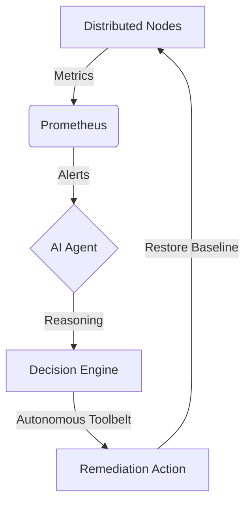

# Agentic AIOps
**The Autonomous Remediation Framework for Distributed Ecosystems**

### Overview
Agentic AIOps is an intelligent orchestration framework that leverages Large Language Models (LLM) to automate the detection, analysis, and remediation of system incidents in real-time. By bridging the gap between observability and corrective action, the system achieves sub-minute Mean Time To Recovery (MTTR) for complex failure signatures including CPU saturation, memory exhaustion, and distributed traffic floods.

### Architecture: The Observe-Reason-Act Loop

| Cluster Node | Public Endpoint | Primary Role |
| :--- | :--- | :--- |
| **Control Node** | `104.215.158.157` | Intelligent Orchestration & Monitoring |
| **Load Generator** | `104.215.191.69` | Traffic Synthesis & Stress Testing |
| **Application Node** | `4.194.57.3` | Production Target & Telemetry Source |

### Key Capabilities

- **Autonomous Decision Intelligence**: Leverages Gemini LLM to distinguish between transient anomalies and critical system failures.
- **Precision Remediation**: Executes surgical process termination and service restoration via hardened remote SSH toolbelts.
- **Synchronized Observability**: Global 1-minute evaluation windows across all Grafana dashboards for zero-latency incident tracking.
- **Zero-Error Architecture**: Stabilized 3-node Azure deployment with dynamic security guards and automated health synchronization.

### Remediation Scenarios

- **CPU Integrity**: Surgical mitigation of distributed `stress-ng` core saturation.
- **Memory Resilience**: Automated OOM recovery and latency stabilization.
- **Network Defense**: High-throughput DDoS mitigation with 100% success verification.

### Monitoring & Dashboards
Access the live observability suite and reasoning logs:

- **Observability Hub**: [Grafana Suite](http://104.215.158.157:3000)
- **AI Action Stream**: [Live Reasoning Log](http://104.215.158.157:8083/logs/ui)

### Documentation & Governance
Detailed operational guides for stakeholders:
- [**Thesis Demo Script**](./demo-guide.md): Step-by-step validation procedures.

### Academic Context
This project was developed as part of the **NT531: Network System Performance Evaluation** course at the **University of Information Technology (UIT)**.
