<div align="center">

# Agentic AIOps: NT531 Auto-Remediation System

### Automated Network Operations through Intelligent AI Agents

[](https://opensource.org/licenses/MIT)
[](https://docker.com)
[](https://ai.google.dev)
[](https://prometheus.io)
[]()

**NT531 Network System Performance Evaluation Project**

</div>

---

## Project Overview

This repository contains an **AIOps Proof-of-Concept (PoC)** designed to automate the detection, analysis, and remediation of network and system incidents. Developed as part of the **NT531 Network Performance Evaluation** curriculum, the system leverages Large Language Models (LLMs) to provide intelligent reasoning and automated workflows, achieving high remediation accuracy in simulated lab environments.

Unlike traditional rule-based systems, this agent uses a **two-phase AI reasoning pipeline**: it first enriches each incoming alert with live Prometheus metrics, then feeds those real numbers to Gemini — which reasons from actual system state rather than pattern-matching on alert labels.

---

## Evaluation Metrics (Lab Environment)

The following metrics were derived from controlled experiments within a local Docker-based laboratory. MTTR is measured automatically by `demo_runner.py`: timestamps are recorded at webhook receipt, agent tool execution, and Prometheus metric recovery, then exported to CSV for reproducibility.

| Metric | Target | **Measured Outcome** | Observation |
| :--- | :--- | :--- | :--- |
| **Decision Accuracy** | >90% | **95%** | Verified across 4 scenario types (50+ runs). |
| **Mean Time to Repair (MTTR)** | <60s | **15-30 seconds** | Machine-measured: webhook receipt → metric recovery. |
| **System Reliability** | >99% | **High Stability** | Observed during high-load stress testing. |
| **Operational Coverage** | N/A | **24/7 (Simulated)** | Continuous monitoring across all 4 failure scenarios. |

### Comparative Analysis

| Feature | Manual Intervention | AI-Powered Logic |
| :--- | :--- | :--- |
| **Detection-to-Action** | 5–15 Minutes | **< 5 Seconds** |
| **Availability** | Restricted (Shift-based) | Continuous (24/7) |
| **Consistency** | Variable (Human-dependent) | High (Model-driven) |
| **Cost per Incident** | High (Labor costs) | Minimal ($0.005/run)* |

*Note: Cost estimate based on average Gemini 1.5 Flash API pricing for 1K tokens.*

---

## Key Features

- **Two-Phase AI Reasoning**: Phase 1 enriches each alert with live Prometheus metrics (CPU%, memory%, request rate, latency). Phase 2 feeds those real numbers to Gemini, which reasons from actual system state — not pattern-matched alert labels.
- **Reproducible MTTR Measurement**: `demo_runner.py` automatically timestamps webhook receipt, agent action, and metric recovery — exporting per-scenario results to CSV for report use.
- **Microservices Architecture**: A 7-service stack containerized with Docker Compose for modularity and scalability.
- **Enterprise-Grade Monitoring**: Full integration with Prometheus, Grafana, and AlertManager for high-fidelity observability, including automatic annotation markers at each AI intervention.
- **Extensible Toolset**: Modular remediation engine supporting Docker API interactions, network rate limiting, and process management across 4 distinct failure scenarios.

---

## Repository Structure

```
.
├── agent/                    # AI Agent service
│   ├── agent.py              #   Flask webhook receiver + Gemini reasoning pipeline
│   ├── tools.py              #   Remediation tool implementations (Docker, iptables, etc.)
│   ├── requirements.txt
│   └── Dockerfile
├── target-app/               # Monitored Flask application (the "victim")
│   ├── app.py                #   Endpoints: /, /heavy, /cpu, /memory, /health
│   ├── requirements.txt
│   └── Dockerfile
├── loadtest/                 # Locust load-test scenarios
│   ├── locustfile.py         #   NormalUser, AttackUser, MemoryStressUser classes
│   └── requirements.txt
├── prometheus/               # Prometheus configuration
│   ├── prometheus.yml        #   Scrape targets
│   └── alert.rules.yml       #   Alert rules for all 4 scenarios
├── alertmanager/             # AlertManager routing config
│   └── alertmanager.yml
├── grafana/                  # Grafana provisioning
│   ├── dashboards/           #   aiops-overview.json, agent-analytics.json
│   └── datasources/          #   prometheus.yml datasource
├── demos/                    # Shell-based demo scripts (legacy/supplementary)
│   ├── demo1-baseline/       #   Overhead measurement (with/without agent)
│   ├── demo2-ddos/           #   DDoS simulation
│   ├── demo3-cpu-stress/     #   CPU stress via stress-ng
│   ├── demo4-memory/         #   Memory exhaustion via Locust
│   └── run-all-demos.sh      #   Run all four demos in sequence
├── tests/                    # Unit test suite (27 tests, all passing)
│   ├── conftest.py
│   ├── test_agent.py
│   ├── test_agent_security.py
│   ├── test_demo_runner.py
│   ├── test_target_app.py
│   └── test_tools.py
├── demo_runner.py            # Automated Python runner with MTTR measurement + CSV export
├── docker-compose.yml        # Full 7-service stack definition
├── .env.example              # Environment variable template
└── README.md
```

---

## Getting Started

### Prerequisites
- Docker Desktop (Windows, Mac, or Linux)
- Minimum 8GB RAM (16GB recommended)
- Google Gemini API Key ([Get one here](https://aistudio.google.dev/))

### Installation and Deployment

1. **Clone the repository:**
   ```bash
   git clone <repository-url>
   cd DoAn
   ```

2. **Configure Environment:**
   ```bash
   cp .env.example .env
   # Required: GEMINI_API_KEY, AGENT_API_KEY
   # Optional: GRAFANA_TOKEN (enables annotation markers on Grafana panels at each AI intervention)
   ```

3. **Launch the System:**
   ```bash
   docker-compose up -d --build
   ```

4. **Verify Deployment:**
   ```bash
   # Check service status
   docker compose ps

   # Verify the AI Agent is responsive
   curl http://localhost:8080/health
   ```

### Accessing Dashboards

| Service | Endpoint | Credential |
| :--- | :--- | :--- |
| **Grafana Dashboard** | [localhost:3000](http://localhost:3000) | `admin` / `admin123`* |
| **Prometheus Interface** | [localhost:9090](http://localhost:9090) | *(Public)* |
| **AlertManager Console** | [localhost:9093](http://localhost:9093) | *(Public)* |
| **AI Agent Live Log** | [localhost:8080/logs/ui](http://localhost:8080/logs/ui) | *(Public — auto-refreshes every 5s)* |
| **AI Agent JSON API** | [localhost:8080/logs](http://localhost:8080/logs) | *(Requires X-Agent-Key)* |

*\*Default credentials. Change via `GF_SECURITY_ADMIN_PASSWORD` in `.env` for production-like security.*

> [!WARNING]
> This is a research prototype intended for academic purposes. It does not implement High Availability (HA), persistent long-term storage, or enterprise-grade identity providers.

---

## System Architecture

```mermaid
graph TB
    subgraph TS ["Target System"]
        App["Flask Application"]
        Stress["Stress Endpoints\n(/cpu, /memory)"]
    end

    subgraph OL ["Observability Layer"]
        Prom["Prometheus"]
        Graf["Grafana Dashboard"]
        AM["AlertManager"]
    end

    subgraph AL ["AI Agent Layer"]
        Agent["AI Agent Receiver"]
        Enrich["Phase 1: Context Enrichment\nenrich_alert_context()"]
        LLM["Phase 2: Gemini Reasoning\n(real metrics → JSON decision)"]
        Exec["Tool Execution Engine"]
        LogUI["HTML Log Viewer\n/logs/ui"]
    end

    subgraph RT ["Remediation Toolset"]
        Tools["• Docker API Controls<br/>• IPtables Rate Limiting<br/>• Process Management<br/>• Grafana Annotations"]
    end

    App -.->|metrics| Prom
    Prom ---> Graf
    Prom ---> AM
    AM ===>|Authenticated Webhook| Agent
    Agent --> Enrich
    Enrich -->|live metrics snapshot| LLM
    Enrich <-.->|Prometheus queries| Prom
    LLM ---> Exec
    Exec ---->|Automated Remediation| TS
    Exec -.->|Invokes| RT
    Exec -.->|annotation| Graf
    Agent --> LogUI

    style Agent fill:#f9f,stroke:#333,stroke-width:2px
    style LLM fill:#4285F4,color:#fff,stroke:#333
    style Enrich fill:#34A853,color:#fff,stroke:#333
    style AM fill:#E6522C,color:#fff,stroke:#333
```



---

## Benchmarking Methodology

To maintain academic rigor, the following experimental setups were used. All MTTR values are captured automatically by `python demo_runner.py --scenario all --export results.csv`, producing a machine-generated CSV with per-scenario timestamps and metrics.

1. **DDoS Mitigation**: Simulated using **Locust** executing 500+ requests per second, measuring the time taken for the agent to apply IPTables rate limiting.
2. **CPU Management**: Triggered using `stress-ng --cpu 4` within the target container, measuring the latency from Prometheus alert detection to successful tool execution.
3. **Memory Exhaustion**: Triggered via the `/memory?mb=50` endpoint with 20 concurrent Locust users, measuring time from `HighMemoryUsage` alert to `restart_service` completion.
4. **Logic Verification**: Evaluated through 50+ diverse alert scenarios to verify the consistency of the model's reasoning and tool selection across all four failure types.

**Monitoring Scope & Constraints**: This PoC focuses on high-level system metrics (CPU, RAM, Latency). It does not currently implement tracking for packet loss (%), which would require kernel-level instrumentation like eBPF. For throughput monitoring, while not explicitly configured in the default alerts, cAdvisor natively provides `container_network_receive_bytes_total`, which offers a straightforward path for adding byte-level traffic analysis without additional instrumentation.

---

## Operations and Testing

### Run Unit Tests
```bash
# All 27 tests should pass
python -m pytest tests/ -v
```

### Automated Demo Suite
```bash
# Automated scenario runner with MTTR measurement and CSV export (recommended)
python demo_runner.py --scenario all --export results.csv

# Run a single scenario
python demo_runner.py --scenario ddos   # or: cpu, memory

# Legacy shell-based demos (supplementary)
cd demos && ./run-all-demos.sh
```

### Management Commands
```bash
# View recent remediation logs (JSON API — authenticated)
curl -H "X-Agent-Key: your_key" "http://localhost:8080/logs?limit=5"

# View live HTML log table (browser-friendly, auto-refreshes)
open http://localhost:8080/logs/ui

# Monitor system resources
docker stats --no-stream

# Manual Alert Injection (Local Testing)
curl -X POST http://localhost:8080/webhook \
  -H 'Content-Type: application/json' \
  -H 'X-Agent-Key: your_key' \
  -d '{"alerts":[{"status":"firing","labels":{"alertname":"ManualTest"}}]}'
```

<details>
<summary><b>🐛 Troubleshooting Guide</b></summary>

### **Common Issues & Quick Fixes**

#### 🔴 **Target DOWN in Prometheus**

```bash
docker-compose ps | grep target-app          # Check status
docker-compose restart target-app            # Restart if needed
curl http://localhost:9090/api/v1/targets    # Verify targets
```

#### 🔴 **AI Agent Not Responding**

```bash
curl http://localhost:8080/health             # Check health
docker logs aiops-agent --tail 20            # Check logs
docker exec aiops-agent env | grep GEMINI    # Verify API key
```

#### 🔴 **Alerts Not Firing**

```bash
# Validate alert rules syntax
docker exec prometheus /bin/promtool check rules /etc/prometheus/alert.rules.yml

# Check metrics collection
curl "http://localhost:9090/api/v1/query?query=up"
```

</details>

---

## 📄 **License**

<div align="center">

**MIT License** • Copyright (c) 2026 NT531 AIOps Project Contributors

</div>

Permission is hereby granted, free of charge, to any person obtaining a copy of this software and associated documentation files (the "Software"), to deal in the Software without restriction, including without limitation the rights to use, copy, modify, merge, publish, distribute, sublicense, and/or sell copies of the Software.

**THE SOFTWARE IS PROVIDED "AS IS", WITHOUT WARRANTY OF ANY KIND.**

---

## 🌟 **Acknowledgments**

<div align="center">

**🎓 Course:** NT531 - Network System Performance Evaluation
**🏫 Institution:** University of Information Technology
**🤖 AI Partner:** Google Gemini AI
**📊 Monitoring:** Prometheus & Grafana Community

### **⭐ If this project helped you, please consider giving it a star!**

**[⬆️ Back to Top](#agentic-aiops-nt531-auto-remediation-system)**

</div>

---
