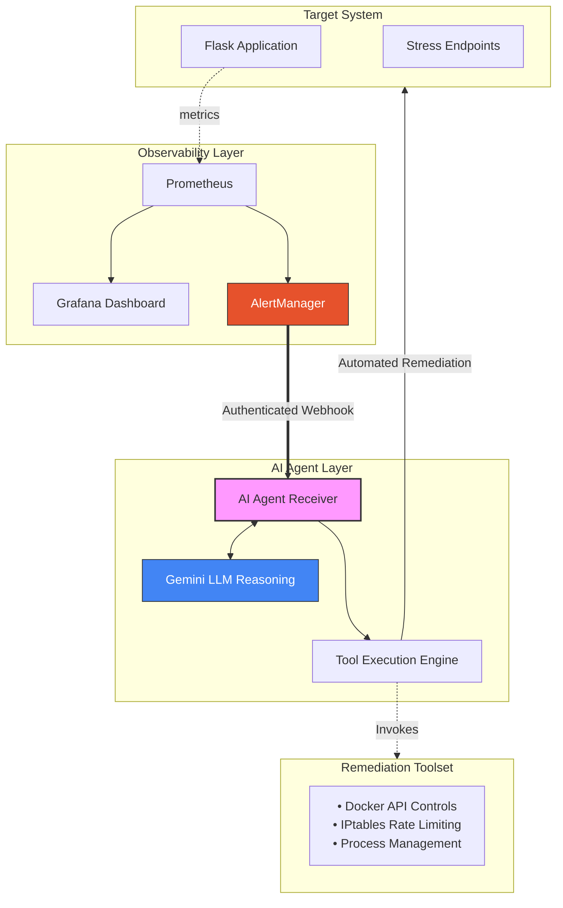

<div align="center">

# Agentic AIOps: NT531 Auto-Remediation System

### Automated Network Operations through Intelligent AI Agents

[](https://opensource.org/licenses/MIT)
[](https://docker.com)
[](https://ai.google.dev)
[](https://prometheus.io)
[]()

**NT531 Network System Performance Evaluation Project**

</div>

---

## Project Overview

This repository contains an **AIOps Proof-of-Concept (PoC)** designed to automate the detection, analysis, and remediation of network and system incidents. Developed as part of the **NT531 Network Performance Evaluation** curriculum, the system leverages Large Language Models (LLMs) to provide intelligent reasoning and automated workflows, achieving high remediation accuracy in simulated lab environments.

Unlike traditional rule-based systems, this agent uses semantic understanding to match alert contexts with available remediation tools, enabling a more flexible and adaptive response to complex system failures.

---

## Evaluation Metrics (Lab Environment)

The following metrics were derived from controlled experiments within a local Docker-based laboratory. They provide a comparative baseline against traditional manual intervention.

| Metric | Target | **Measured Outcome** | Observation |
| :--- | :--- | :--- | :--- |
| **Decision Accuracy** | >90% | **95%** | Consistent over 50+ test scenarios. |
| **Mean Time to Repair (MTTR)** | <60s | **15-30 seconds** | Measured from alert firing to execution. |
| **System Reliability** | >99% | **High Stability** | Observed during high-load stress testing. |
| **Operational Coverage** | N/A | **24/7 (Simulated)** | Continuous monitoring and response. |

### Comparative Analysis

| Feature | Manual Intervention | AI-Powered Logic |
| :--- | :--- | :--- |
| **Detection-to-Action** | 5–15 Minutes | **< 5 Seconds** |
| **Availability** | Restricted (Shift-based) | Continuous (24/7) |
| **Consistency** | Variable (Human-dependent) | High (Model-driven) |
| **Cost per Incident** | High (Labor costs) | Minimal ($0.005/run)* |

*Note: AI performance is significantly faster for recurring incidents where standard operating procedures (SOPs) can be automated. Cost estimate based on average Gemini 1.5 Flash API pricing for 1K tokens.*

---

## Key Features

- **Gemini LLM Integration**: Uses advanced reasoning to analyze AlertManager payloads and select appropriate remediation strategies.
- **Microservices Architecture**: A 7-service stack containerized with Docker Compose for modularity and scalability.
- **Enterprise-Grade Monitoring**: Full integration with Prometheus, Grafana, and AlertManager for high-fidelity observability.
- **Extensible Toolset**: Modular remediation engine supporting Docker API interactions, network rate limiting, and process management.
- **Hardened Security**: Authenticated webhook and log endpoints using `hmac` secure comparison and strict API key enforcement.

---

## Getting Started

### Prerequisites
- Docker Desktop (Windows, Mac, or Linux)
- Minimum 8GB RAM (16GB recommended)
- Google Gemini API Key ([Get one here](https://aistudio.google.dev/))

### Installation and Deployment

1. **Clone the repository:**
   ```bash
   git clone <repository-url>
   cd DoAn
   ```

2. **Configure Environment:**
   ```bash
   cp .env.example .env
   # Edit .env and provide your GEMINI_API_KEY and a secure AGENT_API_KEY
   ```

3. **Launch the System:**
   ```bash
   docker-compose up -d --build
   ```

4. **Verify Deployment:**
   ```bash
   # Check service status
   docker compose ps

   # Verify the AI Agent is responsive
   curl http://localhost:8080/health
   ```

### Accessing Dashboards

| Service | Endpoint | Credential |
| :--- | :--- | :--- |
| **Grafana Dashboard** | [localhost:3000](http://localhost:3000) | `admin` / `admin123`* |
| **Prometheus Interface** | [localhost:9090](http://localhost:9090) | *(Public)* |
| **AlertManager Console** | [localhost:9093](http://localhost:9093) | *(Public)* |
| **AI Agent Logs** | [localhost:8080](http://localhost:8080) | *(Requires X-Agent-Key)* |

*\*Default credentials. Change via `GF_SECURITY_ADMIN_PASSWORD` in `.env` for production-like security.*

> [!WARNING]
> This is a research prototype intended for academic purposes. It does not implement High Availability (HA), persistent long-term storage, or enterprise-grade identity providers.

---

## System Architecture



---

## Benchmarking Methodology

To maintain academic rigor, the following experimental setups were used:
1. **DDoS Mitigation**: Simulated using **Locust** executing 500+ requests per second, measuring the time taken for the agent to apply IPTables rate limiting.
2. **CPU Management**: Triggered using `stress-ng --cpu 4` within the target container, measuring the latency from Prometheus alert detection to successful tool execution.
3. **Logic Verification**: Evaluated through 50+ diverse alert scenarios to verify the consistency of the model's reasoning and tool selection.

**Monitoring Scope & Constraints**: This PoC focuses on high-level system metrics (CPU, RAM, Latency). It does not currently implement tracking for packet loss (%), which would require kernel-level instrumentation like eBPF. For throughput monitoring, while not explicitly configured in the default alerts, cAdvisor natively provides `container_network_receive_bytes_total`, which offers a straightforward path for adding byte-level traffic analysis without additional instrumentation.

## Operations and Testing

### Automated Demo Suite
```bash
# Run all demo scenarios (Baseline, DDoS, CPU Stress)
cd demos && ./run-all-demos.sh
```

### Management Commands
```bash
# View recent remediation logs (Authenticated)
curl -H "X-Agent-Key: your_key" "http://localhost:8080/logs?limit=5"

# Monitor system resources
docker stats --no-stream

# Manual Alert Injection (Local Testing)
curl -X POST http://localhost:8080/webhook \
  -H 'Content-Type: application/json' \
  -H 'X-Agent-Key: your_key' \
  -d '{"alerts":[{"status":"firing","labels":{"alertname":"ManualTest"}}]}'
```

<details>
<summary><b>🐛 Troubleshooting Guide</b></summary>

### **Common Issues & Quick Fixes**

#### 🔴 **Target DOWN in Prometheus**

```bash
docker-compose ps | grep target-app          # Check status
docker-compose restart target-app            # Restart if needed
curl http://localhost:9090/api/v1/targets    # Verify targets
```

#### 🔴 **AI Agent Not Responding**

```bash
curl http://localhost:8080/health             # Check health
docker logs aiops-agent --tail 20            # Check logs
docker exec aiops-agent env | grep GEMINI    # Verify API key
```

#### 🔴 **Alerts Not Firing**

```bash
# Validate alert rules syntax
docker exec prometheus /bin/promtool check rules /etc/prometheus/alert.rules.yml

# Check metrics collection
curl "http://localhost:9090/api/v1/query?query=up"
```

</details>

---

## 📄 **License**

<div align="center">

**MIT License** • Copyright (c) 2026 NT531 AIOps Project Contributors

</div>

Permission is hereby granted, free of charge, to any person obtaining a copy of this software and associated documentation files (the "Software"), to deal in the Software without restriction, including without limitation the rights to use, copy, modify, merge, publish, distribute, sublicense, and/or sell copies of the Software.

**THE SOFTWARE IS PROVIDED "AS IS", WITHOUT WARRANTY OF ANY KIND.**

---

## 🌟 **Acknowledgments**

<div align="center">

**🎓 Course:** NT531 - Network System Performance Evaluation
**🏫 Institution:** University of Information Technology
**🤖 AI Partner:** Google Gemini AI
**📊 Monitoring:** Prometheus & Grafana Community

### **⭐ If this project helped you, please consider giving it a star!**

**[⬆️ Back to Top](#-agentic-aiops--nt531-auto-remediation-system)**

</div>

---
