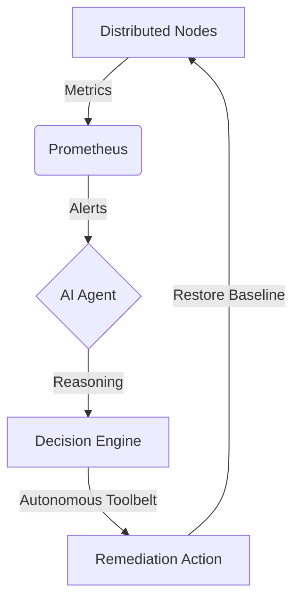

# Agentic AIOps

## The Autonomous Remediation Framework for Distributed Ecosystems

---

### Overview

**Agentic AIOps** is a distributed orchestration framework that leverages Large Language Models (LLMs) to automate the detection, analysis, and remediation of system incidents in real-time. By bridging the gap between observability and corrective action, the system achieves sub-minute Mean Time To Recovery (MTTR) for complex failure signatures across a 3-node Azure cluster.

---

### Architecture: The Observe-Reason-Act Lifecycle



#### Technical Stack Matrix

| Component          | Technology                       | Role                                |
| :----------------- | :------------------------------- | :---------------------------------- |
| **Orchestration**  | Gemini-Native AI Agent (Python)  | LLM Reasoning & SSH Tooling         |
| **Observability**  | Prometheus (v2.x), AlertManager  | Metric Scraping & Alert Propagation |
| **Visualization**  | Grafana (Dashboards-as-Code)     | 1-minute real-time telemetry        |
| **Load Testing**   | Locust, stress-ng, DDoS Engine   | Failure Scenario Synthesis          |
| **Infrastructure** | Azure VMs (B2s), Docker, Compose | Distributed Node Hosting            |

---

### Detailed Cluster Topology & Network Matrix

The environment is synchronized across a 3-node Azure VNet (`10.0.1.0/24`).

| Node       | Public IP         | Role                 | Critical Internal Ports                                                         |
| :--------- | :---------------- | :------------------- | :------------------------------------------------------------------------------ |
| **Node 1** | `<CONTROL_IP>`    | **Control Plane**    | `3000` (Grafana), `9090` (Promet), `9093` (AM), `9091` (PushGW), `8083` (Agent) |
| **Node 2** | `<LOADGEN_IP>`    | **Load Generator**   | `8089` (Locust), `9100` (Node Exp)                                              |
| **Node 3** | `<APP_IP>`        | **Application Node** | `80` (App), `8080` (cAdvisor), `9100` (Node Exp)                                |

---

### Repository Structure

```text
DoAn/
├── src/                          # Application & Agent Logic
│   ├── agent/                    # AI & Rule-based Remediation Engines
│   └── app/                      # Target Flask Application
├── ops/                          # Infrastructure & Observability
│   ├── infra/                    # Docker Compose Deployment Specs
│   └── monitoring/               # Prometheus, Grafana, AlertManager Configs
├── tests/                        # Validation & Performance Suites
│   └── performance/              # Locust Scenarios (scenarios.yml)
├── scripts/                      # Orchestration & Power Control
│   ├── aiops-power.ps1           # Azure VM & Docker Lifecycle
│   └── demo_runner.py            # Automated Validation Suite
└── README.md                     # Master Technical Manual
```

---

### Remediation Scenarios: Technical Deep-Dive

#### 1. CPU Core Saturation (High-Precision Kill)

- **Signature**: 100% Core saturation via `stress-ng`.
- **Reasoning**: Agent differentiates between system stress and application load.
- **Action**: `auto_kill_cpu_stress` targets specific stress binaries via remote SSH.

#### 2. Memory Exhaustion (State Restoration)

- **Signature**: Recursive OOM leak and P99 latency degradation.
- **Reasoning**: Correlation of RAM saturation with application throughput drop.
- **Action**: `restart_service` to purge the container memory space.

#### 3. Network Brute-Force (Resilience Audit)

- **Signature**: 60+ RPS parallel request flood.
- **Reasoning**: Monitoring of success/error rates to identify DDoS signatures.
- **Action**: `restart_service` + connection clearing for baseline recovery.

---

### Telemetry Access Matrix

Comprehensive links to the live observability suite:

| Interface         | URL                                                  | Purpose                            |
| :---------------- | :--------------------------------------------------- | :--------------------------------- |
| **Grafana Suite** | `http://<CONTROL_IP>:3000`                           | Full system health dashboards      |
| **Prometheus UI** | `http://<CONTROL_IP>:9090`                           | Metric targets and alert status    |
| **AI Action Log** | `http://<CONTROL_IP>:8083/logs/ui`                   | Real-time Gemini reasoning log     |
| **AlertManager**  | `http://<CONTROL_IP>:9093`                           | Active incident propagation status |

---

### Deployment Compliance & SSH Hardening

To enable remote remediation, the Agent container requires SSH access to the App Node.

1. **SSH Key Setup**:
   - Ensure your private key is mounted to `/root/.ssh/id_rsa` inside the agent container.
   - **CRITICAL**: The system includes automatic permission hardening (chmod 600) to bypass common Windows-to-Linux volume mounting issues.

2. **Environment Synchronization**:
   - Update `.env` with `AZURE_APP_IP` and `AGENT_API_KEY`.
   - Ensure `TARGET_CONTAINER_NAME` matches the actual container name on Node 3.

---

### Administrative Governance

- [**Thesis Demo Script**](./demo-guide.md): Standardized demonstration procedures.
- [**Development Context**](https://github.com/mquangpham575/AiOps): Source Control Repository.

### Academic Affiliation

Developed for **NT531: Network System Performance Evaluation** at the **University of Information Technology (UIT)**.
