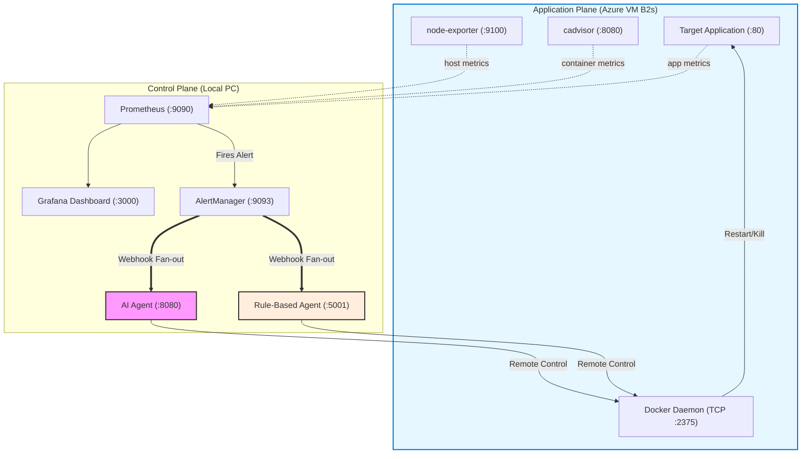

<div align="center">

# Agentic AIOps: NT531 Auto-Remediation System

### Automated Network Operations through Intelligent AI Agents

[](https://opensource.org/licenses/MIT)
[](https://docker.com)
[](https://ai.google.dev)
[](https://prometheus.io)
[]()

**NT531 Network System Performance Evaluation Project**

</div>

---

## Project Overview

This repository contains a **Distributed AIOps Proof-of-Concept (PoC)** designed to automate the detection, analysis, and remediation of system incidents. Developed as part of the **NT531 Network Performance Evaluation** curriculum, the system evaluates the Mean Time To Recovery (MTTR) performance of an **LLM-powered AI Agent** against a traditional **Rule-Based Agent** baseline.

The infrastructure simulates a real-world remote deployment:
- **Control Plane (Windows PC):** Runs the monitoring stack (Prometheus, Grafana, AlertManager) and both intelligent agents.
- **Application Plane (Azure VM):** Runs the target application and exposes Docker TCP metrics for remote observability and management.

---

## Key Features

- **Direct MTTR Baseline Comparison:** A perfect scientific control. AlertManager fans out the *exact same webhook simultaneously* to both a Rule-Based Agent and an AI Agent. Grafana automatically charts the time-to-recovery difference.
- **Two-Phase AI Reasoning**: Phase 1 enriches each alert with live Prometheus metrics (CPU%, memory%, latency). Phase 2 feeds those real numbers to Google Gemini, which reasons from actual system state rather than just pattern-matching alert labels.
- **Distributed Topology**: Cleanly split across `docker-compose.control.yml` (PC) and `docker-compose.app.yml` (Azure) via remote Docker TCP `DOCKER_HOST` connections.
- **Automated Metric Extraction**: `scripts/demo_runner.py` automatically timestamps webhook receipt, agent action latency, and metric recovery — exporting per-scenario results to CSV for thesis reporting.

---

## Repository Structure

```text
DoAn/
├── docker-compose.control.yml     # Control Plane: Prometheus, AlertManager, Grafana, Agents
├── docker-compose.app.yml         # Application Plane: Target app, node-exporter, cadvisor
├── .env.example                   # Environment variable template
├── services/                      # ── BUILDABLE COMPONENTS ──
│   ├── agent/                     # AI Agent (Gemini API integrated)
│   ├── rule-based-agent/          # Traditional baseline static-rule agent
│   └── target-app/                # Monitored Flask application (the victim)
├── config/                        # ── MOUNTED CONFIGURATIONS ──
│   ├── prometheus/                # Scrape targets and alert rules
│   ├── alertmanager/              # Webhook fan-out routing
│   └── grafana/                   # Dashboards and datasources provisioning
├── scripts/                       # ── AUTOMATION ──
│   └── demo_runner.py             # MTTR measurement + CSV export runner
├── loadtest/                      # Locust stress test scenarios
├── tests/                         # Full Pytest suite (27+ tests)
└── demos/                         # Legacy shell-based demo scripts
```

---

## System Architecture



---

## Getting Started

### Prerequisites
- Docker & Docker Compose
- An Azure Virtual Machine (B2s recommended) running Ubuntu + Docker Engine
- Google Gemini API Key ([Get one here](https://aistudio.google.dev/))

### 1. Application Plane Deployment (Azure VM)
Ensure your Azure NSG allows Inbound TCP on ports `80` (App traffic), `2375` (Docker API), `8080` (cAdvisor), and `9100` (Node-exporter). Configure your VM docker daemon to listen on TCP `2375` (configured in `/etc/docker/daemon.json` and systemd).

Clone this repo to your Azure VM and run:
```bash
docker compose -f docker-compose.app.yml up -d --build
```

### 2. Control Plane Deployment (Local PC)
Copy `.env.example` to `.env` and fill out your `GEMINI_API_KEY`, `AGENT_API_KEY`. Be sure the Azure VM IP is correctly targeted in your `.yml` config files so Prometheus and the agents can reach the remote machine.

```bash
docker compose -f docker-compose.control.yml up -d --build
```

### Accessing Dashboards
| Interface | Address | Purpose |
| :--- | :--- | :--- |
| **Grafana** | `http://localhost:3000` | View the live AI vs Rule-Based MTTR Comparison |
| **Prometheus** | `http://localhost:9090` | Verify Azure targets are `UP` |
| **AI Agent Logs** | `http://localhost:8080/logs/ui` | Live view of AI reasoning and actions |
| **AlertManager** | `http://localhost:9093` | Review active alerts |

---

## Operations and Benchmarking

### Automated MTTR Extraction
To automatically test the system and extract MTTR comparisons to a CSV file for your thesis:
```bash
# Run all scenarios sequentially and export results
python scripts/demo_runner.py --scenario all --export results.csv

# Run a specific scenario (ddos, cpu, memory)
python scripts/demo_runner.py --scenario ddos
```

### Run Unit Tests
```bash
# Verify the 27+ test suite passes on the new directory architecture
python -m pytest tests/ -v
```

---

## 📄 License

<div align="center">

**MIT License** • Copyright (c) 2026 NT531 AIOps Project Contributors

</div>

Permission is hereby granted, free of charge, to any person obtaining a copy of this software and associated documentation files (the "Software"), to deal in the Software without restriction.

---

## 🌟 Acknowledgments

<div align="center">

**🎓 Course:** NT531 - Network System Performance Evaluation
**🏫 Institution:** University of Information Technology
**🤖 AI Partner:** Google Gemini AI

</div>
