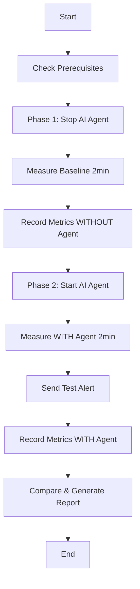

# Demo 1: Baseline Performance Assessment

## 🎯 Objective

Measure the **overhead** introduced by the AI-powered AIOps agent on system resources. This demo compares system performance **with** and **without** the AI agent to quantify the cost of intelligent automation.

## 📋 What This Demo Tests

- **CPU Overhead**: How much CPU the AI agent consumes
- **Memory Usage**: Agent memory footprint
- **Response Time**: Agent alert processing speed
- **System Impact**: Whether the agent affects target application performance

## 🏗️ How It Works

### Architecture

```
┌──────────────────┐
│  Target App      │  ← Monitored application
│  (Flask)         │
└────────┬─────────┘
         │ metrics
         ▼
┌──────────────────┐
│  Prometheus      │  ← Metric collector
└────────┬─────────┘
         │
         ▼
┌──────────────────┐
│  AI Agent        │  ← Can be ON/OFF
│  (Optional)      │     to measure overhead
└──────────────────┘
```

### Test Workflow



## 🚀 Running the Demo

### Prerequisites

```bash
# Ensure system is running
docker compose ps

# All services should show "running":
# - target-app
# - prometheus
# - grafana
# - alertmanager
# - agent
```

### Execute Demo

```bash
cd demos/demo1-baseline

# Give execute permission
chmod +x run.sh

# Run the demo
./run.sh
```

### What Happens:

1. **Prerequisites Check** (10s)
   - Validates all services are running
   - Checks connectivity to APIs

2. **Phase 1: Baseline WITHOUT Agent** (2 minutes)
   - Stops the AI agent container
   - Records target app CPU, memory, network
   - Generates light background load
   - Saves baseline metrics

3. **Phase 2: WITH Agent** (2 minutes)
   - Starts the AI agent
   - Records SAME metrics WITH agent active
   - Sends test alert to agent
   - Captures agent response time
   - Saves comparative metrics

4. **Results Generation**
   - Creates timestamped results file
   - Shows metric comparison
   - Displays agent decision logs

## 📊 Understanding the Results

### Results File Location

```bash
demos/demo1-baseline/results/baseline_YYYYMMDD_HHMMSS.txt
```

### Key Metrics to Look For

#### 1. **Target App Performance**

```
=== BASELINE WITHOUT AI AGENT ===
target-app    2.5%    120MB/2GB    15.2kB/8.1kB

=== WITH AI AGENT ACTIVE ===
target-app    2.6%    121MB/2GB    15.8kB/8.3kB
```

✅ **Expected**: Minimal difference (<1% CPU, <5MB memory)

#### 2. **AI Agent Overhead**

```
agent         4.8%    145MB/2GB    12.1kB/6.2kB
```

✅ **Expected**: <5% CPU, <150MB memory

#### 3. **Agent Response Time**

```
AI AGENT TEST RESPONSE
Response received in: 1.2 seconds
Decision: "Acknowledged baseline test alert"
```

✅ **Expected**: <2 seconds response time

### Interpreting Results

| Metric            | Target | Good   | Acceptable | Poor   |
| ----------------- | ------ | ------ | ---------- | ------ |
| **Agent CPU**     | <5%    | <3%    | 3-5%       | >5%    |
| **Agent Memory**  | <150MB | <100MB | 100-150MB  | >150MB |
| **Response Time** | <2s    | <1s    | 1-2s       | >2s    |
| **App Impact**    | 0%     | <1%    | 1-2%       | >2%    |

## ✅ Validating Results

### Run Validation Script

```bash
# Auto-detect latest results
./validate.sh

# Or specify results file
./validate.sh results/baseline_20260324_143022.txt
```

### What Validation Checks:

1. ✅ **File Integrity**: All required sections present
2. ✅ **Metrics Comparison**: Both baseline and with-agent data
3. ✅ **Agent Functionality**: Test alert was processed
4. ✅ **Performance Thresholds**: Within acceptable limits
5. ✅ **Live System Health**: Current system status

### Validation Output

```bash
=== Validation Summary ===
Validation Score: 5/5 (100%)

✅ ALL VALIDATIONS PASSED!

✓ Demo 1 results are valid and complete
✓ AI Agent overhead is within acceptable limits
✓ System performance meets requirements
```

## 📈 Visualizing in Grafana

### Open Grafana Dashboard

```bash
# Open in browser
http://localhost:3000

# Login credentials
Username: admin
Password: admin123
```

### Locate Demo Period

1. Go to **"NT531 AIOps System Overview"** dashboard
2. Set time range to demo execution time
3. Look for **agent container restart** (shows start/stop)

### Key Panels to Check

- **CPU Usage by Container**: Compare target-app vs agent
- **Memory Usage**: Agent memory footprint
- **Network I/O**: Minimal overhead expected
- **Alert Processing Time**: Agent response latency

## 🔍 Troubleshooting

### Agent Fails to Start

```bash
# Check logs
docker logs aiops-agent --tail 50

# Verify API key
docker exec aiops-agent env | grep GEMINI

# Restart agent
docker compose restart agent
```

### Missing Metrics

```bash
# Check Prometheus targets
curl http://localhost:9090/api/v1/targets | jq

# Verify target-app metrics endpoint
curl http://localhost:5000/metrics
```

### Results File Empty

```bash
# Check if containers are running
docker compose ps

# Verify result directory exists
ls -la results/

# Check disk space
df -h
```

## 📚 Command Reference

### During Demo

```bash
# Watch agent logs in real-time
docker logs -f aiops-agent

# Monitor Docker stats
watch -n 2 'docker stats --no-stream'

# Query Prometheus
curl "http://localhost:9090/api/v1/query?query=up"

# Check agent health
curl http://localhost:8080/health | jq
```

### After Demo

```bash
# View agent decision logs
curl http://localhost:8080/logs?limit=10 | jq

# Check recent alerts
curl http://localhost:9093/api/v1/alerts | jq

# Export Grafana dashboard
# Dashboard → Share → Export → Save to file
```

## 🎓 Learning Objectives

After running this demo, you should understand:

1. **Resource Cost of AI**: Quantify the overhead of AI-powered monitoring
2. **Performance Trade-offs**: Balance between intelligence and efficiency
3. **Baseline Methodology**: How to establish performance baselines
4. **Metrics Collection**: Using Docker stats and Prometheus queries
5. **Comparative Analysis**: Measuring delta between configurations

## 🔗 Related Demos

- **Demo 2**: DDoS Response - See agent in action handling attacks
- **Demo 3**: CPU Stress - Watch agent automatically remediate issues

## 💡 Expected Outcomes

### Successful Demo Shows:

- ✅ Agent adds **<5% CPU overhead**
- ✅ Agent uses **<150MB memory**
- ✅ Agent responds in **<2 seconds**
- ✅ **Zero impact** on target application performance
- ✅ System remains **100% stable**

### Academic Value:

- **Quantifiable Results**: Precise overhead measurements
- **Scientific Method**: Controlled before/after comparison
- **Production Relevance**: Real-world performance data
- **Cost-Benefit Analysis**: Intelligence vs efficiency trade-off

## 📝 Report Template

Include these sections in your report:

1. **Methodology**: How you measured overhead
2. **Data**: Raw metrics from both phases
3. **Analysis**: Comparison and interpretation
4. **Conclusion**: Is the overhead acceptable?
5. **Recommendations**: Production deployment feasibility

## 🎯 Success Criteria

Demo is successful if:

- [x] Complete baseline metrics collected
- [x] Complete with-agent metrics collected
- [x] Agent responds to test alert
- [x] Overhead within acceptable limits
- [x] No system crashes or errors
- [x] Results validated successfully

---

**Next**: [Demo 2 - DDoS Response](../demo2-ddos/README.md) →
