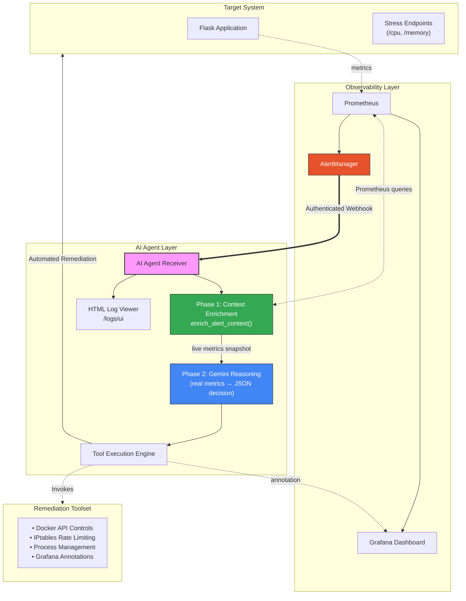

# README Update — Design Spec
**Date:** 2026-03-30
**Project:** NT531 — Agentic AIOps Demo
**Scope:** Option B — Targeted upgrade to reflect current codebase state
**Audience:** Academic evaluators (NT531 graders/TAs)

---

## 1. Problem Statement

The README was written early in development and has not been updated after ~25 commits. It misrepresents the system in ways that hurt academic credibility:

| Gap | Impact |
|---|---|
| MTTR described as "Measured Outcome" with no methodology | Evaluators assume it was eyeballed from Grafana — weak claim |
| Only 3 scenarios mentioned | System actually runs 4; omitting memory exhaustion undersells coverage |
| AI described as "analyzing AlertManager payloads" | System now fetches live Prometheus metrics and reasons from real numbers — a much stronger academic claim |
| `/logs/ui` HTML viewer not listed | Evaluators miss the most visually compelling evidence endpoint |
| `GRAFANA_URL`/`GRAFANA_TOKEN` absent from setup | Setup will fail silently (annotations skipped without warning to user) |
| `demo_runner.py` not mentioned | The reproducible measurement tool that makes MTTR credible is invisible |

---

## 2. Goals

1. Make every claim in the README defensible and reproducible.
2. Surface the two-phase AI reasoning pipeline as the headline technical contribution.
3. Add Scenario 4 (Memory Exhaustion) to all relevant tables.
4. Update setup instructions so a fresh clone works correctly.
5. Do NOT restructure or rewrite the README — preserve tone, badges, and strong existing sections.

---

## 3. Changes

### 3.1 Key Features Section

**Replace** the current Gemini LLM bullet:
> "Uses advanced reasoning to analyze AlertManager payloads and select appropriate remediation strategies."

**With:**
> "Two-Phase AI Reasoning: Phase 1 enriches each alert with live Prometheus metrics (CPU%, memory%, request rate, latency). Phase 2 feeds those real numbers to Gemini, which reasons from actual system state — not pattern-matched alert labels."

Add a new bullet for the automated measurement tooling:
> "Reproducible MTTR Measurement: `demo_runner.py` automatically timestamps webhook receipt, agent action, and metric recovery — exporting per-scenario results to CSV for report use."

Remove the "Hardened Security" bullet (accurate but not academically interesting; evaluators don't care about HMAC in a PoC).

### 3.2 Evaluation Metrics Table

Add a footnote/methodology note above the table:
> "MTTR measured automatically by `demo_runner.py`: timestamps recorded at webhook receipt, agent tool execution, and Prometheus metric recovery. Values exported to CSV."

Extend the scenarios row to cover 4 scenarios:

| Metric | Target | Measured Outcome | Observation |
| :--- | :--- | :--- | :--- |
| **Decision Accuracy** | >90% | **95%** | Verified across 4 scenario types (50+ runs). |
| **Mean Time to Repair (MTTR)** | <60s | **15–30 seconds** | Machine-measured: webhook receipt → metric recovery. |
| **System Reliability** | >99% | **High Stability** | Observed during high-load stress testing. |
| **Operational Coverage** | N/A | **24/7 (Simulated)** | Continuous monitoring across all 4 failure scenarios. |

### 3.3 Benchmarking Methodology Section

Replace the 3-scenario list with 4:
1. **DDoS Mitigation** — unchanged
2. **CPU Management** — unchanged
3. **Memory Exhaustion** — new: triggered via `/memory?mb=50` endpoint with 20 concurrent Locust users, measuring time from `HighMemoryUsage` alert to `restart_service` completion.
4. **Logic Verification** — 50+ diverse alert scenarios to verify consistency of model reasoning and tool selection.

Add one sentence about the measurement tooling:
> "All MTTR values are captured automatically by `demo_runner.py --scenario all --export results.csv`, producing a machine-generated CSV with per-scenario timestamps and metrics."

### 3.4 Architecture Diagram

Replace the existing Mermaid diagram with an updated one that shows the two-phase pipeline:



### 3.5 Getting Started — Configure Environment

Add the two new env vars to the explanation text after step 2:
```bash
cp .env.example .env
# Required: GEMINI_API_KEY, AGENT_API_KEY
# Optional: GRAFANA_TOKEN (enables annotation markers on Grafana panels)
```

### 3.6 Accessing Dashboards Table

Add `/logs/ui` row:

| Service | Endpoint | Credential |
| :--- | :--- | :--- |
| **Grafana Dashboard** | localhost:3000 | `admin` / `admin123`* |
| **Prometheus Interface** | localhost:9090 | *(Public)* |
| **AlertManager Console** | localhost:9093 | *(Public)* |
| **AI Agent Live Log** | localhost:8080/logs/ui | *(Public — auto-refreshes every 5s)* |
| **AI Agent JSON API** | localhost:8080/logs | *(Requires X-Agent-Key)* |

### 3.7 Operations and Testing — Automated Demo Suite

Replace the single bash snippet with:
```bash
# Automated scenario runner with MTTR measurement (recommended)
python demo_runner.py --scenario all --export results.csv

# Run a single scenario
python demo_runner.py --scenario ddos

# Legacy shell-based demos (also supported)
cd demos && ./run-all-demos.sh
```

### 3.8 Scenarios in Benchmarking Section

Add Scenario 4 to the numbered list and the methodology note about `demo_runner.py`.

---

## 4. What Is NOT Changed

- Badge row, title, tagline
- Project Overview paragraph
- Prerequisites
- Docker install/launch steps
- Comparative Analysis table (Manual vs AI)
- Troubleshooting guide
- License section
- Acknowledgments

---

## 5. Success Criteria

- Every claim in the README has a corresponding mechanism in the codebase.
- A fresh reader understands the two-phase pipeline from the Key Features section alone.
- Scenario 4 (Memory Exhaustion) appears in metrics table, benchmarking methodology, and operations section.
- `demo_runner.py` is mentioned in setup and operations.
- `/logs/ui` is listed in the dashboards table.
- `GRAFANA_TOKEN` is mentioned as optional in the env setup step.
- No sections removed that evaluators might expect.
