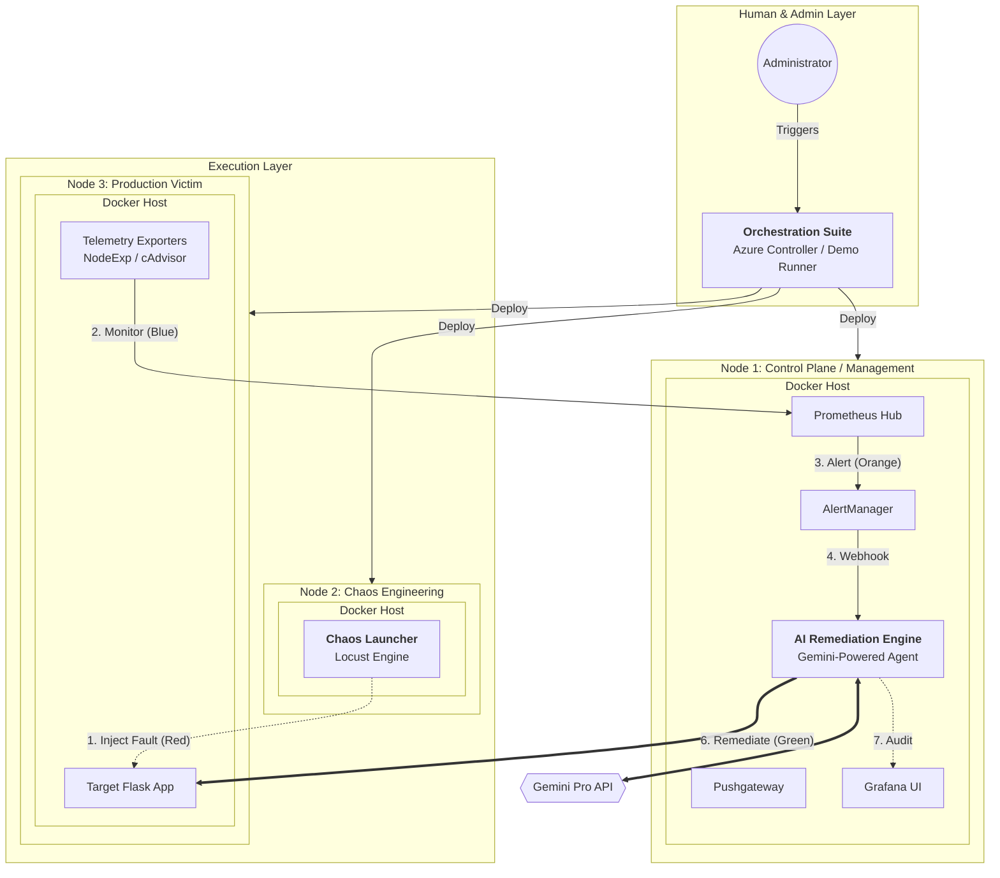

# Agentic AIOps: High-Level Architecture Design Spec
## Professional Diagram Guide (Draw.io / LucidChart)

This document serves as the visual specification for building a professional architecture diagram. Use the following layers and logic to represent the system accurately for your thesis.

---

### 1. Visual Topology (Mermaid Preview)

---

### 2. Draw.io Design Instructions

#### A. Layered Structure
*   **Layer 1 (Top)**: Place the **User/Admin** icon. Connect it to the Orchestration tools.
*   **Layer 2 (Middle)**: The **Control Plane (Node 1)**. This is your largest box. It should house the observability stack and the AI Agent.
*   **Layer 3 (Bottom)**: Place **Node 2 (Chaos)** on the left and **Node 3 (Victim)** on the right to show clear separation of concern.

#### B. Professional Iconography
| Component | Draw.io Icon (Recommended) | Visual Note |
| :--- | :--- | :--- |
| **Nodes (VMs)** | Azure Virtual Machine (Blue cube) | Use the official Azure Stencil. |
| **Docker** | Docker Whale | Place as a background container inside each VM. |
| **AI Agent** | Brain / Robot / Sparkle | Use a distinct color (Red or Neon Gold). |
| **Failure** | Lightning Bolt / Fire | Place near the Chaos Launcher (Locust). |
| **Gemini** | Cloud / Star | Place in the 'Cloud' area outside your VNet. |

#### C. Color-Coded Flow Logic (The "Threads")
Use the following colors for connections to make the diagram readable:
*   🔴 **Red (Chaos/Attack)**: From Locust to Flask App. (Label: "Inject Fault").
*   🔵 **Blue (Observability)**: From App Exporters to Prometheus. (Label: "Scrape Telemetry").
*   🟠 **Orange (Alerting)**: From AlertManager to AI Agent. (Label: "Webhook Notification").
*   🟢 **Green (Recovery)**: From AI Agent to Flask App via SSH. (Label: "**Autonomous Remediation**").
*   🟣 **Purple (Reasoning)**: Between AI Agent and Gemini API.

---

### 3. Functional Component Descriptions

| Component | Functional Label | Thesis Role |
| :--- | :--- | :--- |
| **Locust** | Chaos Synthesis Engine | Synthesizes complex failure signatures (DDoS, OOM, CPU Saturation). |
| **Prometheus** | Temporal Data Hub | Aggregates time-series data and evaluates incident rules. |
| **AI Agent** | Remediation Orchestrator | Performs LLM-based root cause analysis and executes corrective SSH commands. |
| **Grafana** | Visualization & Audit | Provides real-time health metrics and intervention audit logs. |
| **Flask App** | Target Workload | Microservice baseline representing the production ecosystem. |
