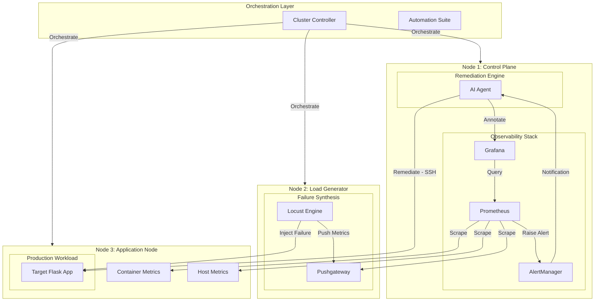

# Agentic AIOps Hybrid Topology
## Unified Repository & Cluster Architecture

This diagram visualizes the mapping between the repository source code and the physical 3-node Azure cluster deployment.

### Component Definition & Repo Mapping

| Functional Component | Purpose | Repository Location |
| :--- | :--- | :--- |
| **Cluster Controller** | Automated VM and container lifecycle. | `aiops-power.ps1` |
| **Observability Stack** | Multi-layer metric collection and alerting. | `ops/monitoring/` |
| **AI Reasoning Engine** | LLM-based root cause analysis & remediation. | `src/agent/ai-agent/` |
| **Failure Synthesis** | Simulates CPU/RAM/Network failure scenarios. | `tests/performance/` |
| **Production Workload** | The target application being monitored. | `src/app/` |
